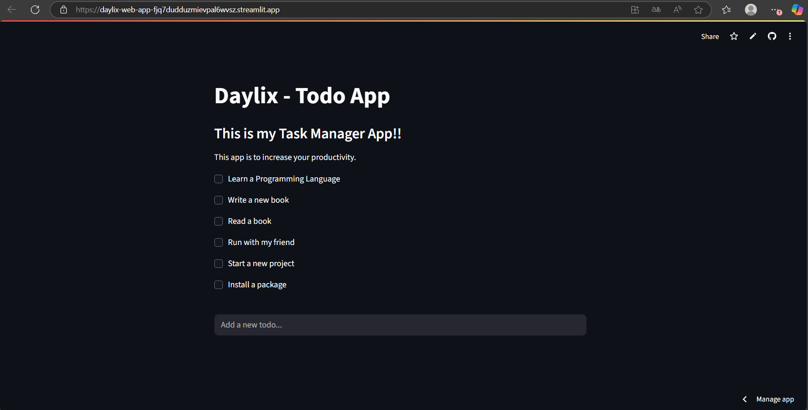

# Daylix Web App 📝

Web app interativo do gerenciador de tarefas **Daylix**, desenvolvido com **Streamlit**.  
Permite adicionar, completar e gerenciar tarefas diretamente no navegador.

### 🚀 Deploy
👉 [Acesse o Daylix Web App online](https://daylix-web-app-fjq7dudduzmievpal6wvsz.streamlit.app/)

## Funcionalidades

- Adicionar tarefas via campo de texto
- Concluir tarefas clicando nas checkboxes
- Lista de tarefas atualizada dinamicamente
- Armazenamento persistente das tarefas em arquivo `todos.txt`

## 🗂️ Estrutura do Projeto

- `web.py`: código principal do web app
- `functions.py`: funções para ler/escrever tarefas (`get_todos`, `write_todos`)
- `todos.txt`: arquivo que armazena as tarefas

## 🧱 Estrutura do Código

- `get_todos(filepath=FILEPATH)`: lê o arquivo `todos.txt` e retorna uma lista de tarefas  
- `write_todos(todos, filepath=FILEPATH)`: salva a lista de tarefas no arquivo `todos.txt`  
- O app usa **Streamlit** para exibir a interface e permitir interações com checkboxes e campos de texto

## 🛠️ Tecnologias Utilizadas
- **Python 3.13.2**
- **Streamlit**
- **Git & GitHub**

## 📚 Aprendizados
O projeto Daylix me ajudou a aprender e praticar:
- Estruturação de projetos em Python
- Uso de Git e GitHub
- Versionamento e práticas de commits
- Criação de interfaces diferentes (CLI, GUI, Web)
- Deploy de aplicações na nuvem

## Como usar
*Existem 2 maneiras de utilizar o Daylix Web App:*
1. **Você pode acessar o projeto diretamente pelo link, sem precisar instalar nada:**

👉 [Acesse aqui o Daylix](https://daylix-web-app-fjq7dudduzmievpal6wvsz.streamlit.app/)

2. **Rodando localmente (opcional)**

Se quiser testar o app na sua máquina, siga os seguintes comandos:

```bash
git clone https://github.com/gabriel-oligom/daylix-web-app
cd daylix-web-app
python -m venv venv        # cria ambiente virtual
source venv/bin/activate   # Linux/Mac
venv\Scripts\activate      # Windows
pip install -r requirements.txt
streamlit run web.py
```

### 📸 Preview do Daylix Web App
